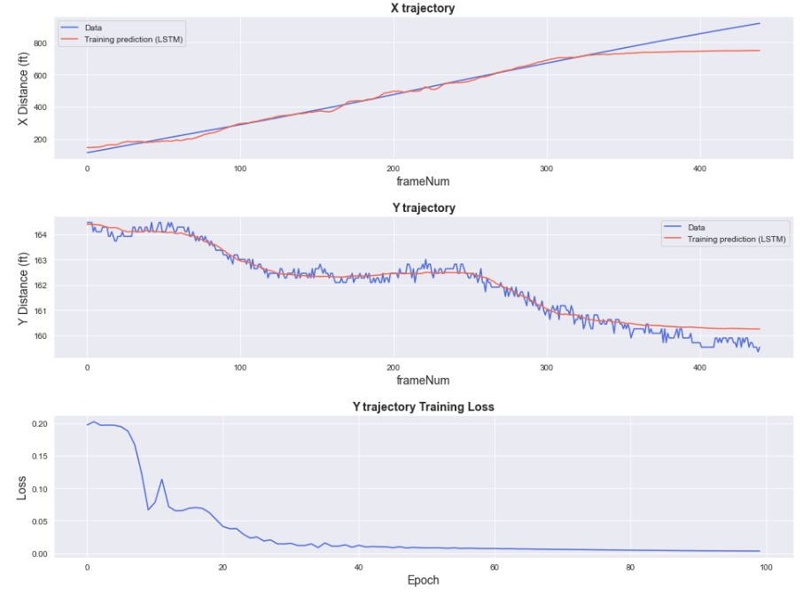

# Vehicle trajectory points prediction
### Objective
Applied the drone trajectory data (30fps) to predcit the future trajectory points based on LSTM model.

### Dataset
https://github.com/UCF-SST-Lab/UCF-SST-CitySim1-Dataset

*Vehicle trajectories applied in this study were derived from the CitySim dataset, a publicly accessible dataset generated through drones across 12 distinct sites. This dataset comprehensively captures a broad spectrum of roadway configurations, including elementary segments of highways, weaving sections, expressway merge/diverge sections, stop-controlled intersections, and unsignalized/signal-controlled intersections. Notably, the positions of the  vehicle center, head, tail, and bounding box vertices, as well as vehicle heading could be provided, thereby making the conflict detection results more accurate. Besides, the locations of this dataset mainly contain the United States of America and Asia. Its beta version was released in April 2022. Importantly, the CitySim dataset, generated from birds-eye-view drone-based trajectories, was developed to include five innovative characteristics: precise vehicle trajectories, wider vehicle trajectory range, more safety-critical events, accurate geometric representation of vehicles, and a digital twin feature.
*The drone maintained a stable height of 120 meters and captured videos at 30 frames per second, with a recording resolution of 5120 x 2880 pixels. Generally, videos were recorded in 20-minute intervals, with the drone following a straight path from the ground to the vantage point. This pipeline includes video stabilization, object filtering, multi-video stitching, detection and tracking, and enhanced error filtering. Specifically, video stabilization ensures that the captured video remains steady despite any minor movements of the drone, improving the clarity and usability of the footage. Object filtering removes irrelevant objects from the background to reduce the number of false positives in vehicle detection. Multi-Video stitching combines multiple video segments into a continuous sequence, increasing the length of the recorded trajectories. Detection and tracking utilize algorithms to identify vehicles with bounding boxes and track the movement of vehicles within the video frames. Enhanced error filtering applies data fixing tools to manually delete wrongly detected objects and adjust the sizes and headings of erroneous bounding boxes to minimize errors in the tracking data, ensuring high accuracy in the final trajectory results.*

### Output

